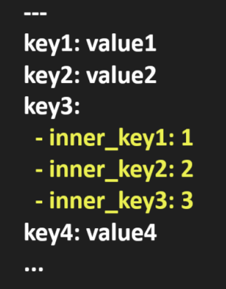

# YAML parser 
Simple and strict YAML format parser written with Rust usint pest crate.
## Task description
! Brief Description: Include a brief description of the idea in both the Readme.md and Cargo.toml files. The Readme.md must contain a technical description of the parsing process, detailing what exactly is being parsed and how the results of the parsing will be used.

! Project Name: The project name must reflect the idea and be included in both the Readme.md and Cargo.toml files. +

! Grammar Rules: Develop at least 1 grammar rule for the parser. +

! Unit Tests: Implement unit tests for the parser; these can be placed in a separate file within the tests directory. +

! Test Coverage: Ensure each grammar rule is covered by at least one unit test.

! Core Files: The project must include lib.rs and main.rs files. +

! CLI: Create a command-line interface that includes commands to parse a file and to display help and credits information.

Error Handling: Implement proper error handling by using anyhow for tests and thiserror for the library.

cargo fmt should be used for code formatting.

cargo clippy should be used for linting to ensure code quality.

A makefile should include commands to launch the program and to run tests, format and clipply before committing as well other useful commands.

Completeness: The project must be completed fully.

Including a diagram or grammar in the Readme.md can facilitate understanding of the parsing logic.

Documentation: For each grammar rule, embed documentation in the code, ensuring that the documentation appears on docs.rs.

Publishing: Release the final version of the package on crates.io. 

## YAML data type description 

YAML files use indentation and whitespace to define data structures. It does not rely on explicit symbols like JSON, making it easy for humans to read and write.

```
---
element1: "value1"
element2: "value2"
...
```
one more example
```
---
name: Alisa
age: 20
hobbies:
  - reading
  - hiking
address:
  city: Kyiv
  country: Ukraine 
```

The main difference between yaml and json file types is that yaml doesn't use any specific delimiters except the spaces : and -
There are many yaml validators, most of them support different rules except from the basic ones. 
This parser works with yaml files with a strict structure:
1. File can start with --- and/or end with ...
2. Each element has the depth 1 so it can not contain more than one inner group of elements
3. The indentation before each inner key-value pair is equal to 2


valid simple yaml file, yellow - subnode

### Link to crates.io


### Usage
Now you can run this program by simply entering ```cargo run``` or run tests with ```cargo test```. Later more advanced features will be added. 

## Code flow 
lib.rs imports all necessary tools and contains function that can be used to read data from file. 
main.rs imports everything (from lib.rs file especially) and then proceeds to the main funciton. 
tests are placed into tests folder. Grammar tests can be found in the file named grammar_tests.rs

## Rules description
The first defined rule full_yaml determines whether the input file may contain the valid yaml structure by checking if it starts with ---. Later I will create another rules for every substructures of yaml and combine them in this rule. 
|rule| description|
|----|----|
| full_yaml | matches the whole yaml file that can start with --- and can end with ...|
|  object  | matches key - value pairs 1 or more times  |
| helpnode | mathces key - value pair that appears in subnode|
| subnode | inner node of the key defined|
| key_value | matches every string and value pairs separated by : and 0 or 1 space|
| value | subnode or scalar, every subnode must be started from a new line, so that key and value(subnode) are placed into different lines |
| scalar | new line separator with any available datatype |
| number | matches any integer or float(double) number or number in format a^x|
| boolean | true or false |
|null | null|
|string | any ascii letter(s) with or without number that can contain -|
|line_end| defines 3 different "line ending" characters|
|indent| 2 spaces that are used at the start of every key - value pait in subnode|

### Crates used
[pest](https://pest.rs/#editor)

[anyhow](https://docs.rs/anyhow/latest/anyhow/)


